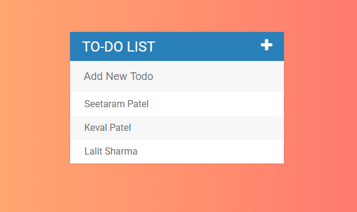

<h1>To-Do-List Project</h1>

To-Do-List is a fun and very handy tools which we make in vanila js

You can use this To-Do-List project for your daily routine tasks. You can just add your work and you can't forget that work. is it cool!

This Project also use google font which is ROBOTO, font-awesome library for icons and world's powerful programming language - JavaScript (It's in not kidding)

<h2>Group Members</h2>
		<li>Seetaram Patel 200393396</li>
		<li>Keval Patel		200393482</li>
		<li>Lalit Sharma	200395019</li>
 

